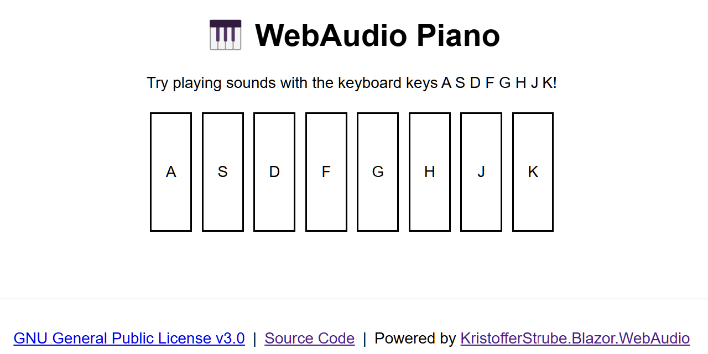

# Blazor - WebAudio Piano

This demo project showcases how easily Blazor apps can access the Web Audio API. This Blazor WebAssembly app allows us to play sounds using keyboard keys like a piano — sounds fun, right?

The live demo is available at [https://sample-by-jsakamoto.github.io/Blazor-WebAudio-Piano/](https://sample-by-jsakamoto.github.io/Blazor-WebAudio-Piano/).

This project utilizes the **"KristofferStrube.Blazor.WebAudio"** NuGet package to interact with the Web Audio API.

https://github.com/KristofferStrube/Blazor.WebAudio

This package provides a simple way to access the Web Audio API in Blazor apps.

## License

[GNU General Public License version 3.0](LICENSE)